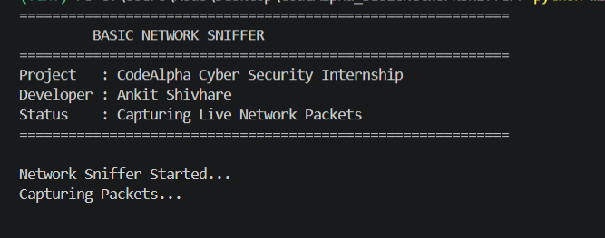
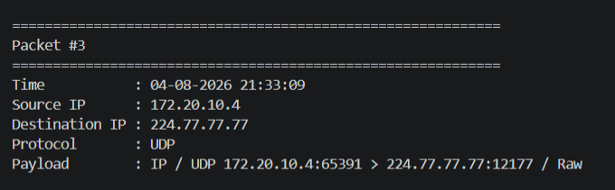
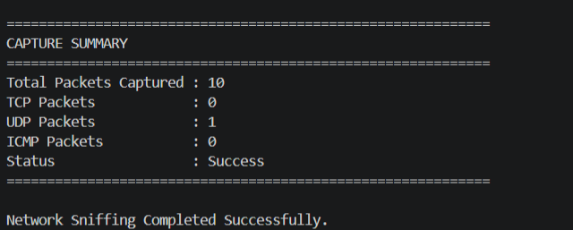

# 🛡️ Basic Network Sniffer

> A Python-based Network Packet Sniffer developed using **Scapy** as part of the **CodeAlpha Cyber Security Internship**.


---

# 📖 Table of Contents

- Project Overview
- Features
- Technologies Used
- Project Workflow
- Project Structure
- Installation
- How to Run
- Sample Output
- Screenshots
- Learning Outcomes
- Future Enhancements
- Author
- License

---

# 📌 Project Overview

Basic Network Sniffer is a Python application that captures and analyzes live network packets using the **Scapy** library.

The application extracts important information from captured packets, including:

- Source IP Address
- Destination IP Address
- Network Protocol
- Packet Payload
- Packet Timestamp

After capturing packets, the application generates a protocol-wise summary showing the number of TCP, UDP and ICMP packets captured.

This project was developed to understand packet sniffing, network traffic analysis and basic network protocols.

---

# ✨ Features

- Capture live network packets
- Display Packet Number
- Display Packet Timestamp
- Display Source IP Address
- Display Destination IP Address
- Detect TCP Protocol
- Detect UDP Protocol
- Detect ICMP Protocol
- Display Packet Payload
- Professional Terminal Output
- Protocol Statistics
- Capture Summary
- Beginner Friendly Code

---

# 🛠 Technologies Used

| Technology | Purpose |
|------------|---------|
| Python 3 | Programming Language |
| Scapy | Packet Capture & Analysis |
| VS Code | Code Editor |
| Git | Version Control |
| GitHub | Project Hosting |

---

# ⚙ Project Workflow

```
Start Program
      │
      ▼
Capture Live Packets
      │
      ▼
Check IP Layer
      │
      ▼
Extract Source IP
      │
      ▼
Extract Destination IP
      │
      ▼
Detect Protocol
      │
      ▼
Read Payload
      │
      ▼
Display Packet Information
      │
      ▼
Generate Capture Summary
```

---

# 📂 Project Structure

```
CodeAlpha_BasicNetworkSniffer
│
├── main.py
├── README.md
├── requirements.txt
├── .gitignore
├── LICENSE
└── screenshots
    ├── output1.png
    ├── output2.png
    └── output3.png
```

---

# 🚀 Installation

Clone the repository

```bash
git clone https://github.com/ankit-cybersec/CodeAlpha_BasicNetworkSniffer.git
```

Move to project directory

```bash
cd CodeAlpha_BasicNetworkSniffer
```

Create virtual environment

```bash
python -m venv venv
```

Activate virtual environment

Windows

```bash
venv\Scripts\activate
```

Install dependencies

```bash
pip install -r requirements.txt
```

---

# ▶ How to Run

Execute the following command

```bash
python main.py
```

The program captures live packets and displays:

- Packet Number
- Timestamp
- Source IP
- Destination IP
- Protocol
- Payload

Finally, a protocol summary is displayed.

---

# 🖥 Sample Output

```
============================================================
                 BASIC NETWORK SNIFFER
============================================================

Packet #1

Time            : 04-08-2026 13:20:18
Source IP       : 192.168.1.112
Destination IP  : 40.79.150.122
Protocol        : TCP
Payload         : IP / TCP ...

============================================================

CAPTURE SUMMARY

Total Packets Captured : 10
TCP Packets            : 4
UDP Packets            : 3
ICMP Packets           : 0

Status                 : Success

Network Sniffing Completed Successfully.
```

---

# 📷 Screenshots

### Program Output

> Add your project screenshots inside the **screenshots** folder.

```
screenshots/
│
├── output1.png
├── output2.png
└── output3.png
```

After uploading screenshots, add:

```markdown





```

---

# 🎓 Learning Outcomes

This project helped me understand:

- Network Packet Sniffing
- Packet Structure
- Network Traffic Analysis
- Source & Destination IP
- TCP Protocol
- UDP Protocol
- ICMP Protocol
- Packet Payload
- Python Networking
- Scapy Library
- Basic Cyber Security Monitoring

---

# 🔮 Future Enhancements

- Continuous Packet Capture
- Packet Filtering
- Save Logs into CSV
- Save Logs into JSON
- Export Reports
- GUI Version
- Real-Time Dashboard
- Packet Search
- Live Monitoring

---

# 👨‍💻 Author

**Ankit Shivhare**

Cyber Security Enthusiast

CodeAlpha Cyber Security Intern

---

# 📄 License

This project is licensed under the MIT License.

---

# ⭐ Support

If you found this project useful, consider giving it a ⭐ on GitHub.